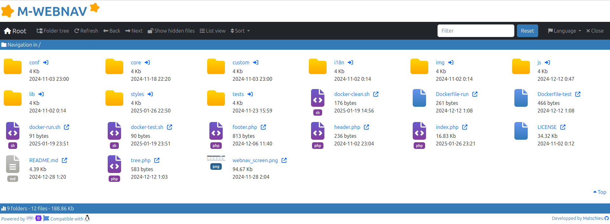

[](https://github.com/matschieu/webnav/actions/workflows/docker-app.yml)

# M-Webnav

## Description

[M-Webnav](https://github.com/matschieu) is an application to view files and navigate through folders of a filesystem.<br>
It is only a view in read-only of the filesystem. It is not possible to create, edit or delete a file or a folder.<br>
The application doesn't use any database and doesn't provide any right management or authentication.

It can be used to expose files inside a larger application or website and can be customized to have the same look and feel. 



## Third parties

The application is fully written in [PHP8](https://php.net).<br>
The interface is built using [Bootstrap](https://getbootstrap.com) for responsives components and [Font-Awesome](https://fontawesome.com) for the set of icons.<br>
Testing is performed using [Docker](https://www.docker.com) and [PHPUnit](https://phpunit.de).

<p>
	
	&nbsp;&nbsp;
	
	&nbsp;&nbsp;
	
</p>

## Running tests with Docker

The tests can be executing with PHPUnit.

1. To build the image containing the tests, run the command `docker build -f Dockerfile-test -t webnav-test .`
2. Then run the application with `docker run webnav-test`

## Running the app with Docker

The application can be ran locally using Docker.

1. To build the image containing the application, run the command `docker build -f Dockerfile-run -t webnav .`
2. Then run the application with `docker run -d -p 8080:80 webnav`
3. The application can be displayed in a web browser at the URL [http://localhost:8080](http://localhost:8080)

## Deploying the application

To deploy the application on a server (with Apache and PHP>=8 installed), you need to copy the following files in the right folder:
- conf
- core
- i18n
- img
- lib
- styles
- footer.php
- header.php
- index.php
- tree.php

## Customization

You can active the debug mode, set the root folder or customize the look and feel of the application by overriding header, footer and CSS styles. all of this can be done by updating the file conf/app.ini. Each key of the file is documented in comment inside the original file as you can see below:

```ini
# To display some debug information on the page
debug = false

# This is the context where the webapp is deployed
# It must start with a '/'
# Empty value means that the app is deployed to the root of the server
webapp.context = /webnav

# The root dir of the file system to explore
# It can be a relative to the index.php path or an absolute path
# Must be set
filesystem.root = .

# Define the default language in which the application is displayed
application.default.language = en

# Define if the hidden files are display by default or not, if true then display hidden files
application.default.showhidden = false

# Define the default view, if false then display block view, else display the list view
application.default.listview = false

# Application information
# Will be displayed at least in the tab title
application.name = M-WEBNAV

# Enable the gradient style for icons
application.style.gradient = true

# Relative path to the custom CSS file, should be in ./styles
# Empty value means that no custom CSS will be used
application.custom.css = 

# Relative path to the custom favicon, should be in ./img
# Empty value means that no favicon will be used
application.favicon = ./img/favicon.png

# Header of the file explorer, can contains some HTML
# Empty value means that no header will be displayed
application.header = ./header.php

# Footer of the file explorer, can contains some HTML
# Empty value means that no footer will be displayed
application.footer = ./footer.php

# Enable to display the menu 
application.enable.menu = true

# Enable to display the menu to display folder tree 
application.enable.menu.foldertree = true

# Enable to display the menu to refresh the page 
application.enable.menu.refresh = true

# Enable to display the menu to go back to the previous page 
application.enable.menu.back = true

# Enable to display the menu to go forward to the next page 
application.enable.menu.next = true

# Enable to display the menu to show the hidden files 
application.enable.menu.showhidden = true

# Enable to display the menu to change the view type
application.enable.menu.changeview = true

# Enable to display the menu to sort the file
application.enable.menu.sort = true

# Enable to display the menu to change the language
application.enable.menu.changelanguage = true

# Enable to display the menu to close the page
application.enable.menu.close = true

# Enable to display the textfield to filter the files 
application.enable.menu.filter = true

# Date format used to display file date/time
# Must be set
application.date.format = Y-m-d G:i
```